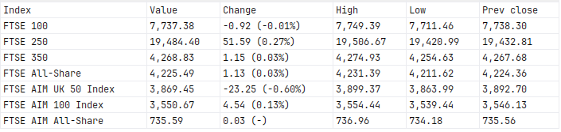

# RulethuStockExchange

This gem allows you to scrape stock exchange data from the following exchanges:

- Zimbabwe Stock Exchange (ZSE)
- Johannesburg Stock Exchange (JSE)
- London Stock Exchange (LSE)

## Installation

Install the gem and add to the application's Gemfile by executing:

    $ bundle add rulethu_stock_exchange

If bundler is not being used to manage dependencies, install the gem by executing:

    $ gem install rulethu_stock_exchange

## Usage

** Make sure you have firefox browser installed **

### Example 1: Scraping Data From London Stock Exchange

Require the gem

```ruby
require 'rulethu_stock_exchange'
```

Get the stock exchange. (Currently available stock exchanges are ZSE, JSE and LSE)

```ruby
exchange = RulethuStockExchange::Exchanges::LSE
```

Create a Scraper passing in the url for the exchangew

```ruby
scraper = RulethuStockExchange::Scraper.new exchange[:url]
```

Scrape the data passing in a selector

```ruby
html = scraper.scrape exchange[:selector]
```

Create a parser to parse the data

```ruby
parser = RulethuStockExchange::Parser.new html
```

Parse the data

```ruby
data = parser.parse()
```

Write the data to JSON file

```ruby
filename = RulethuStockExchange::IO.write_to_json_file data, 'lse'
```

Convert the JSON file to CSV

```ruby
RulethuStockExchange::IO.json_to_csv filename
```

The CSV file is generated as follows



### Example 2: Scraping Data From Zimbabwe Stock Exchange

For Zimbabwe Stock Exchange, the procedure is the same as in the previous example except that the parsing method is different as shown below.

```ruby
data = parser.parse_zse()
```

## Development

After checking out the repo, run `bin/setup` to install dependencies. Then, run `rake test` to run the tests. You can also run `bin/console` for an interactive prompt that will allow you to experiment.

To install this gem onto your local machine, run `bundle exec rake install`. To release a new version, update the version number in `version.rb`, and then run `bundle exec rake release`, which will create a git tag for the version, push git commits and the created tag, and push the `.gem` file to [rubygems.org](https://rubygems.org).

## Contributing

Bug reports and pull requests are welcome on GitHub at https://github.com/rulethu/rulethu_stock_exchange.

## License

The gem is available as open source under the terms of the [MIT License](https://opensource.org/licenses/MIT).
